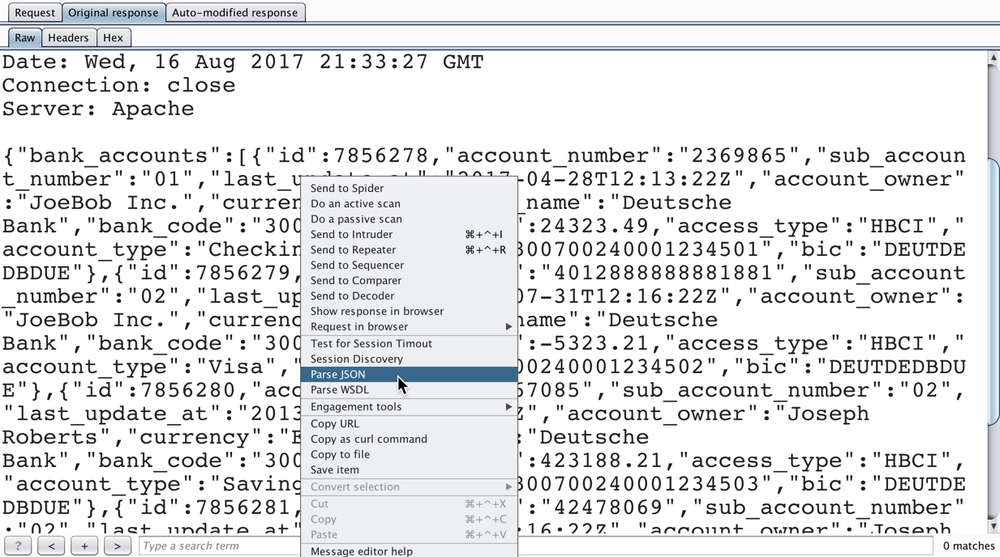
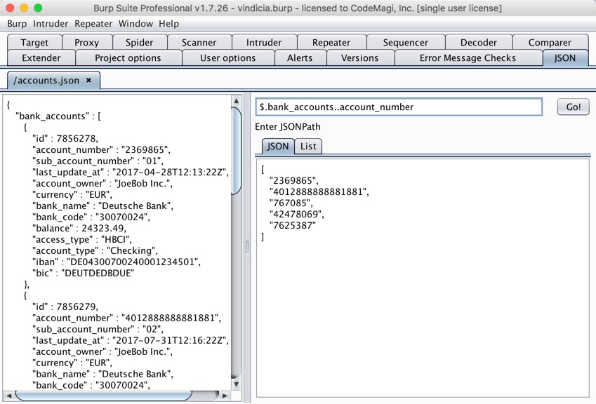
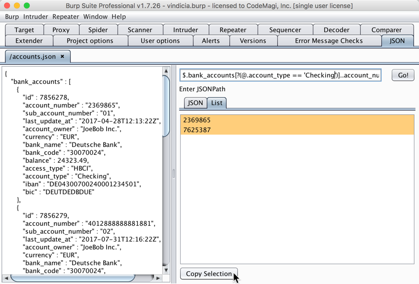

# burp-suite-jsonpath
Burp Suite extension to view and extract data from JSON responses. 

### Parse
Parse and beautify JSON responses: 

### Query
Query JSON with [JSONPath](https://github.com/json-path/JsonPath) (clicking a field in the left hand column will pre-populate the JSONPath query): 

### Copy
Copy results for use in other tools: 

